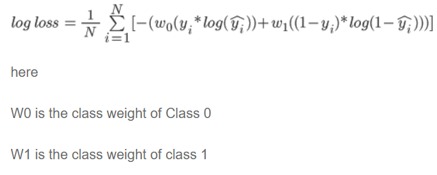
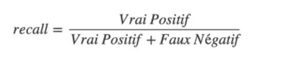
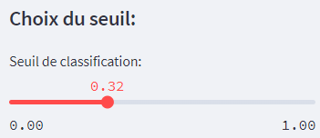
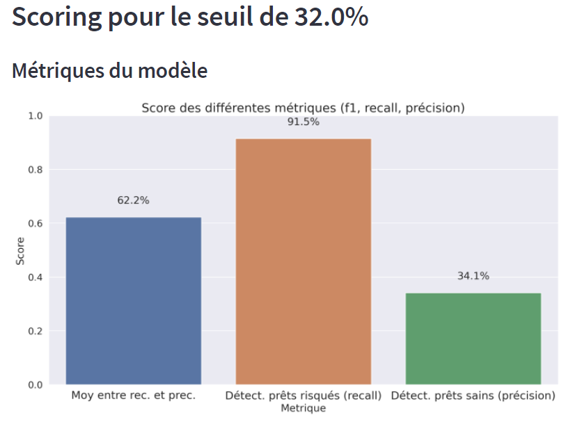
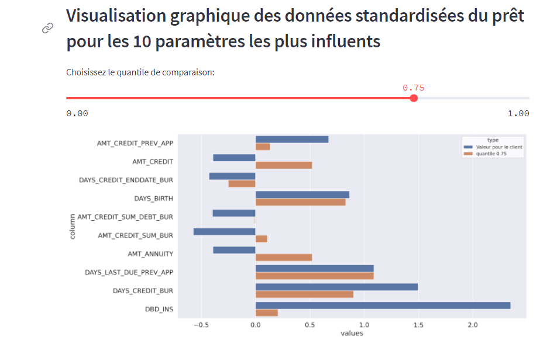

# PROJET 7 - IMPLÉMENTER UN MODÈLE DE SCORING
# NOTE MÉTHODOLOGIQUE

Lien du github où se trouve le notebook ainsi que les différentes sources:

https://github.com/Nordine67200/P7_Openclassroom

## CONTEXTE

• Dans le cadre du projet 7 de la formation Data Scentist, il est demandé d'implémenter un modèle de scoring de demande de prêt. Cette note présente le processus de modélisation et d'interprétabilité.

• Une société financière, nommée **"Prêt à dépenser"**, qui propose des crédits à la consommation pour des personnes ayant peu ou pas du tout d'historique de prêt, désire mettre en œuvre un modèle de "scoring crédit" qui correspond à la probabilité qu'un client rembourse le prêt.

• Les données utilisées comportent un fichier contenant les demandes de prêts ainsi que d'autres fichiers correspondant à l'historique des précédents prêts dans l'application et auprès d'autres organismes financiers.

## METHODOLOGIE D'ENTRAINEMENT DU MODELE

Le modèle a été entrainé avec un jeu de donnée issue d'un preprocessing comportant les phases de feature engineering, consolidation, nettoyage et transformation. Le

notebook utilisé est consultable sur le site kaggle:

([https://www.kaggle.com/code/nordinerajaoui/notebook708a653bac/notebook#Analyse-univariée])

Le jeu de données étant déséquilibrée: 92% des données ne sont pas des prêts ne présentent pas de risque de défaut de paiement tandis que seul 8% en présente. De

ce fait, si l'on sépare le jeu de données en données de training et de test de manière aléatoire, il y a des risques que l'on n'ait que les prêts en risque dans le jeu de training ou de test, ce qui nous donnera un mauvais score.

La séparation se fera en utilisant la fonction train\_test\_split (sklearn.model\_selection) avec l'option stratify=y.

Les données représentant les défauts de paiement étant largement minoritaire (8%), il n'a pas assez de représentants pour que le modèle en apprenne le pattern. Pour éviter ce problème, deux approches ont été testées:

\- SMOTE: algorithme qui synthétise des données pour la classe minoritaire. Permet de créer un jeu de données équilibré.

\- class weights: plus de poids est appliqué aux données minoritaire (ici les prêts en défaut de paiement) dans la fonction de coût de sorte à accorder une plus grosse pénalité et ainsi modifier les paramètres du model:

**TUNING des hyper-paramètres**

Etant donné la lenteur de GridSearchCV qui compare les performances pour chaque combinaison de valeurs de plage de chaque paramètre, deux types d'approche ont été testé:

\- RandomizedSearchCV: contrairement à GridSearchCV, toutes les valeurs de paramètre ne sont pas testées, mais un nombre fixe de paramètres est échantillonné à partir des distributions spécifiées. Le nombre de paramétrages essayés est donné par n\_iter.

\- BayesianOptimisation: méthode séquentielle basée sur le processus gaussien pour trouver le minimum d'une fonction (on détermine une fonction qui prend en entrée les hyperparamètres et retourne le score)

Ces deux approches ont été utilisées sur des jeux de données enrichies par la méthode SMOTE puis sans mais en utilisant l'hyperparamètre class\_weight sur les algorithmes de machine learning ci-dessous:

\- RandomForestClassifier

\- XGBoostClassifier

\- LGBMClassifier

## METRIQUES

**Fonction de coût**

|**Algorithme**|**Fonction de coût**|
| :- | :- |
|RandomForestClassifier|Gini impurity|
|XGBoostClassifer|Log loss|
|LGBMClassifer|Log loss|

***Métrique d’évaluation***

**Choix de la métrique**

Dans le jeu de données, il y’a une part de 92 % des clients qui n’ont pas d’incident de paiement tandis que seulement de 8% des clients ont eu des incidents.

La matrice de précision se présente ainsi :

||Clients prédits sans risque|Clients prédits en risque|
| :- | :- | :- |
|Clients sans défaut|Vrais négatif|Faux positif|
|Clients réellement en défaut|Faux négatif|Vrais positif|

Les pertes financières liées aux défauts de paiement sont bien plus important que la perte potentielle de clients. Il est donc préférable de mieux prédire les clients en risque de défaut de paiement. On essaiera donc de maximiser le recall :

Cela dit, il faudra aussi faire attention à ne pas avoir une précision trop faible pour maximiser le nombre de clients :

Cet arbitrage se fait via le seuil de classification. Plus il sera faible, plus la classification favorisera les vrais positifs mais aussi les faux positifs (hausse du recall et baisse des précisions). Plus il sera élevé et plus il favorisera les vrais négatifs mais aussi les faux négatifs (hausse de la précision et baisse du recall)

Ce choix s’effectue via le dashboard :

## INTERPRETABILITE DU MODELE

Les équipes opérationnelles devant être en mesure d'expliquer les décisions de l'algorithmes, un dashboard est mis à leur disposition avec deux volets principales:

\- Volet analyse par prêt: permet de visualiser le score ainsi que la décision et de l'expliquer via une comparaison des 10 paramètres les plus influents avec les données d'un quantile au choix:

\- Voletanalyse du modèle: permet de visualiser la performance du modèle par seuil de décision (voir plus haut).

## AMELIORATIONS POSSIBLES

