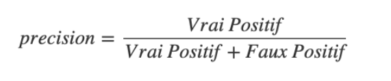

***Métrique d’évaluation***

**Choix de la métrique**

Dans le jeu de données, il y’a une part de 92 % des clients qui n’ont pas d’incident de paiement tandis que seulement de 8% des clients ont eu des incidents.

La matrice de précision se présente ainsi :

||Clients prédits sans risque|Clients prédits en risque|
| :- | :- | :- |
|Clients sans défaut|Vrais négatif|Faux positif|
|Clients réellement en défaut|Faux négatif|Vrais positif|

Les pertes financières liées aux défauts de paiement sont bien plus important que la perte potentielle de clients. Il est donc préférable de mieux prédire les clients en risque de défaut de paiement. On essaiera donc de maximiser le recall :

Cela dit, il faudra aussi faire attention à ne pas avoir une précision trop faible pour maximiser le nombre de clients :

Cet arbitrage se fait via le seuil de classification. Plus il sera faible, plus la classification favorisera les vrais positifs mais aussi les faux positifs (hausse du recall et baisse des précisions). Plus il sera élevé et plus il favorisera les vrais négatifs mais aussi les faux négatifs (hausse de la précision et baisse du recall)

Ce choix s’effectue via le dashboard :

